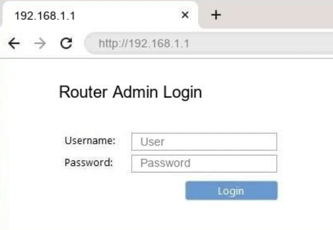

# Step-by-Step Guide to Securing Your Home Wi-Fi

This guide outlines the essential steps to enhance the security of your home Wi-Fi network and protect it from unauthorized access and cyber threats.

## 1. Change Default Router Credentials
### Why It’s Important
Most routers come with default usernames and passwords that are publicly known, making them vulnerable to unauthorized access.

### How to Change It
1. Open a web browser and enter your router’s IP address (e.g., `192.168.1.1` or `192.168.0.1`).
2. Log in using the default credentials (found on the router label or manual).
3. Navigate to the **Admin Settings** section.
4. Change both the **username** and **password** to unique, strong values.
5. Save the changes and log out.

  
*Figure 1: Router login page (192.168.1.1)

## 2. Enable Strong Encryption (WPA3 or WPA2)
### Why It’s Important
Encryption protects your network traffic by making it unreadable to unauthorized users.

### How to Enable It
1. Log into your router settings.
2. Go to the **Wireless Security** section.
3. Select **WPA3** (or **WPA2** if WPA3 is unavailable).
4. Save the settings and restart the router.

  
*Figure 2: Enabling WPA3 encryption in router settings.*

## 3. Update Your Router Firmware
### Why It’s Important
Firmware updates fix security vulnerabilities and improve performance.

### How to Update It
1. Access your router’s admin panel.
2. Navigate to **Firmware Update** or **Software Update**.
3. Check for available updates and install them.
4. Restart the router after the update completes.

## 4. Disable Remote Management
### Why It’s Important
Remote management allows external access to your router settings, which can be exploited by attackers.

### How to Disable It
1. Log into your router.
2. Navigate to **Advanced Settings** > **Remote Management**.
3. Disable remote access and save changes.

## 5. Set a Strong Wi-Fi Password
### Why It’s Important
A weak password makes it easy for unauthorized users to access your network.

### How to Create a Secure Password
- Use at least **12 characters**.
- Include a mix of **uppercase letters, lowercase letters, numbers, and symbols**.
- Avoid personal information or common words.

## 6. Create a Guest Network
### Why It’s Important
A guest network separates visitor devices from your main network, reducing security risks.

### How to Set It Up
1. Log into your router.
2. Navigate to **Guest Network Settings**.
3. Enable the **Guest Network** feature.
4. Set a separate, secure password.
5. Restrict guest access to **internet only**.
6. Save changes.

## 7. Disable WPS (Wi-Fi Protected Setup)
### Why It’s Important
WPS is a known security risk that allows attackers to bypass encryption.

### How to Disable It
1. Open your router settings.
2. Locate **Wi-Fi Protected Setup (WPS)**.
3. Disable it and save changes.

## 8. Enable Firewall and Monitor Connected Devices
### Why It’s Important
A firewall protects your network from external threats, while monitoring connected devices helps detect unauthorized users.

### How to Enable and Monitor
1. Log into your router and go to **Firewall Settings**.
2. Enable the firewall and intrusion detection, if available.
3. Check the **Connected Devices List** regularly.
4. If unknown devices appear, change the Wi-Fi password immediately.

---

By following these steps, you can significantly enhance the security of your home Wi-Fi network. If you encounter issues, refer to the [Troubleshooting](troubleshooting.md) section for solutions.

